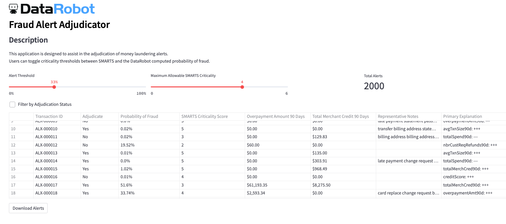

# AML Adjudicator 

Small Streamlit Application used for adjudicating AML alerts from a rule based system.

Uesrs can toggle thresholds for a criticality score and prediction score on an alert in order to lower their manual review workload.

## Access

View the app here: https://share.streamlit.io/mpkrass7/fraud_adjudicator/fraud_adjudicator.py

